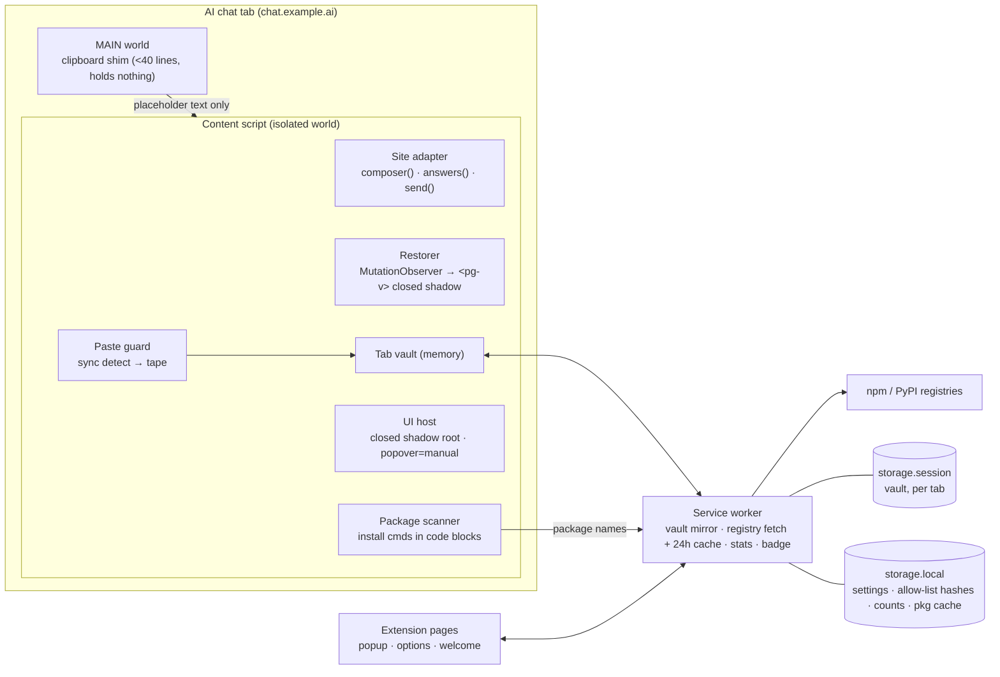
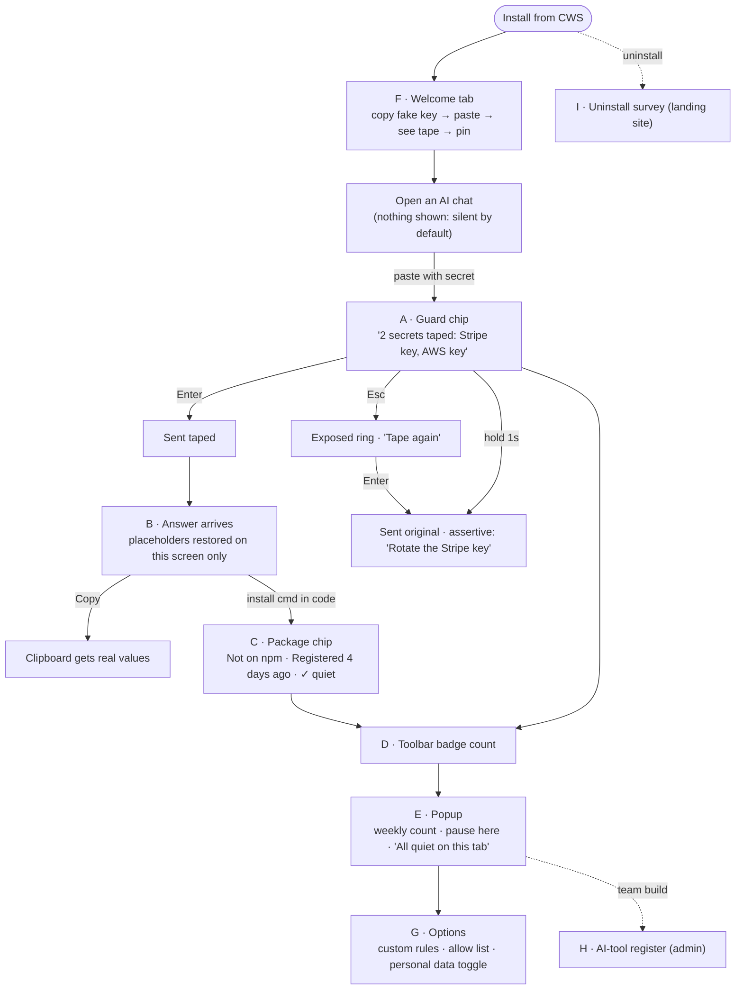

# PasteGuard extension: PRD, architecture and build plan (2026-09-30)

Reads with: `extension-decision-report.md` (§5 UX, §9 kill criteria, §11 feasibility), `apps/extension/design/index.html` (surfaces A–I, budgets, state matrix, voice). This doc does not repeat them. It decides **how** we build.

---

## 0. The one promise, and what "accurate" means

> **"Secrets you paste into AI chats never leave your device. Packages the AI invents get flagged before you install them."**

To make this promise and keep it, we define accuracy as numbers we publish and enforce in CI:

| Promise | Measured by | Gate (CI fails below) |
|---|---|---|
| We catch listed secret types | Recall on the public positive corpus (format-valid fake keys, gitleaks fixtures, MIT) | ≥ 98% per rule, ≥ 99% overall |
| We don't nag | False positives per 1 MB of the negative corpus (real code, logs, UUIDs, git SHAs, hashes, base64 images, lockfiles) | ≤ 1 per MB |
| The secret never reaches the site | E2E test: paste into mock chat → assert the value is absent from the network log, the page DOM, and page-world JS | 0 leaks, every build |
| "Not on npm" is true | Verdict matches the registry status code | 100% (it's a 404, deterministic) |
| We stay invisible | Budgets from the design doc (≤ 25 KB content script, ≤ 5 ms p95 detect on 10 KB, 0 network on AI pages) | Size and bench checks in CI |

Marketing only uses these numbers, and each links to the corpus in the OSS repo. If we can't measure a claim, we don't make it.

---

## 1. Two findings that change the design (staff-engineer review)

These are the reasons to spike before building anything else.

### 1a. Restored values must not enter the page's DOM
The design doc's restore view (surface B) swaps `PG_SECRET_1` → real value in the AI answer. If we write that value as a normal text node, **the AI site's own JS can read it**: `document.body.innerText`, its analytics, or a session-replay SDK. That breaks the promise quietly.

**Design:** replace each placeholder with a `<pg-v>` host element that has a **closed shadow root** holding the value. Page JS sees `<pg-v>` with no readable text (`el.shadowRoot === null` for closed roots). Re-apply when React re-renders (already planned: MutationObserver, 50 ms debounce).
**Spike:** confirm (1) `innerText`/`textContent` of ancestors exclude closed-shadow text, (2) user text selection + ⌘C still copies the real value (or we handle `copy` ourselves), (3) streaming re-renders don't flicker past the 2 ms budget.

### 1b. The clipboard wrapper must not hold secrets in the page's world
The plan puts a `world: "MAIN"` script around `navigator.clipboard.writeText` to make the AI's Copy button return real values. If that script holds the vault, **the page can read the vault**, because MAIN world is the page's JS heap.

**Design:** the MAIN-world wrapper holds nothing. It intercepts `writeText(text)`, and if `text` contains `PG_SECRET_` it dispatches a DOM event with the placeholder text and resolves. The **isolated-world** content script substitutes the values and calls `navigator.clipboard.writeText` itself, using the same user activation. Secrets never touch page memory.
**Spike:** confirm the transient user activation still holds when the isolated world writes, on all three sites.

### 1c. The paste handler must decide synchronously
`preventDefault()` has to run inside the `paste` event, so we can't `await` the service worker. So **detection runs in the content script, synchronously**, which is why rules count against the 25 KB budget. For pastes over 256 KB: always `preventDefault`, scan in chunks with `scheduler.yield()`, then insert.

---

## 2. PRD

### Users
| Persona | Job to be done | Buys? |
|---|---|---|
| **Dev (primary)** | "Let me paste my stack trace / .env / config into ChatGPT without thinking about it." | Free; the viral loop |
| **Eng lead / founder** | "Prove to a customer's security questionnaire that we control AI use." | Team $4/user |
| **Security/IT at 20–200 person co** | "Know which AI tools people use; stop keys leaking." | Team + compliance add-on |

### Scope by release
**P0 (MVP, public build, chatgpt.com, claude.ai, gemini.google.com)**
1. Paste guard: detect → tape (redact to `PG_SECRET_n`) → chip (A). `Enter` sends taped, `Esc` undoes, hold 1 s to send the original.
2. Reversible restore in answers (B), closed-shadow values, "this tab only".
3. Copy button returns real values (1b).
4. Package check (C): install commands in code blocks → npm/PyPI → Not found / new (< 30 days) / low downloads / looks like a popular package (edit distance ≤ 2 to the top 5k names).
5. Toolbar icon states (D), popup (E): weekly count, pause on this site.
6. Welcome tab (F): time-to-wow < 30 s with a fake key.
7. Allow list: "Always allow this" stores **SHA-256 of the value**, never the value.
8. Uninstall URL → 1-question survey on the landing site (I).
9. **Chat-leak scan:** on the first visit to each conversation, run `detect()` over the visible user turns (through `adapter`), then show one chip: *"This conversation contains an AWS key. Rotate it →"*. Type only, never the value, once per conversation. This is wow moment #1 in `product-strategy.md` §3.
10. **Rotate links:** a static map of about 30 providers (Stripe, AWS, OpenAI, GitHub…) → their key-management page. Shown after hold-to-send-original and on chat-scan findings.

**P1 (days 15–45)**: typed secrets on Enter/send-click; custom rules (G); drag-drop of text files; Edge listing (same zip); more AI sites via a generic adapter.

**P2 (team, gated by day-60 kill criterion)**: team build, `chrome.storage.managed` policy, AI-tool register (H), weekly digest, Stripe/merchant-of-record billing, evidence export.

### Non-goals (said out loud)
Desktop apps, CLIs, mobile, API traffic; images/PDF scanning; blocking by default; any server-side content processing; Python import scanning.

### Default rule set: a product decision
The `Email address` rule in today's `detect.js` will fire on almost every support ticket or log someone pastes. **Recommend: secrets on by default, PII (email, phone, card, Aadhaar/PAN) off by default** under a "Personal data" toggle. Cards stay on because they are Luhn-checked and rarely false.

---

## 3. Tech stack (with the calls on Tailwind, shadcn and zod)

| Layer | Choice | Why |
|---|---|---|
| Extension framework | **WXT** (Vite-based) | Actively maintained MV3 framework: manifest generated from code, HMR, Chrome/Edge/Firefox targets from one codebase, `--mode` for public vs team builds, zip + submit commands. Plasmo is the alternative; its maintenance has slowed. |
| Language | **TypeScript, `strict`** | Message contracts and the vault are where bugs become leaks. |
| In-page UI (A, B, C) | **Vanilla TS + a 20-line `h()` helper + plain CSS in the closed shadow root** | 25 KB budget, hostile host page, 3 tiny components. Any framework costs budget and gains nothing here. |
| Extension pages (popup, options, welcome) | **Preact + signals** (~5 KB) | Real component model for the options page (rules editor, site list, allow list) at 1/10th of React. |
| Styling | **Plain CSS with the DESIGN.md tokens** (one `tokens.css`, shared by in-page and pages) | The design doc is already written in token CSS and can be lifted verbatim. |
| Tailwind | **Skip** | It adds a build step and a second vocabulary for tokens we already have. It also can't reach into the closed shadow root without injecting a generated stylesheet. Revisit if the page count passes ~6. |
| shadcn/ui | **Skip** | It's React + Radix + Tailwind (too heavy for pages, unusable in-page), and its look fights DESIGN.md. Use native `<dialog>`, `popover`, `<details>` and `:focus-visible`, which the design doc already uses. |
| Validation | **zod (`zod/mini`) in the service worker, pages and Worker. Hand-written type guards in content scripts.** | Validate at every trust boundary (below). `zod/mini` tree-shakes small; content scripts stay in budget with guards. |
| Core logic | **`packages/core`: zero dependencies, pure functions** | Detect, redact, placeholder match, install-command parse, verdict, typosquat. Runs in Node, the extension and the landing page. Tests: `node --test` (repo convention). |
| E2E | **Playwright** with the unpacked extension, against local **mock chat pages** (ProseMirror, textarea, contenteditable) | Deterministic CI. Real sites checked by a daily logged-out smoke run where the site allows it, otherwise a manual weekly check. |
| Backend (P2 only) | **Cloudflare Worker + D1 + KV** | Already on Cloudflare; free tier covers the pilot. |
| Analytics | **Opt-in, extension pages only, counts only** (PostHog or a Worker counter) | Nothing runs on AI pages. Events: install, activated, weekly_active, uninstall. No content, no URLs. |
| Errors | **No automatic error reporting.** "Copy diagnostic" button in the popup with scrubbed stacks. | A crash report from a paste handler can contain the paste. |

### Trust boundaries (where validation is mandatory)
| From → to | Trust | Guard |
|---|---|---|
| Page (MAIN world) → content script (DOM events) | **Hostile** | Type guard + only accept placeholder-shaped strings; never return vault data |
| Content script → service worker (`runtime.sendMessage`) | Low (renderer can be compromised) | `zod/mini` schema per message, check `sender.id` and `sender.tab` |
| Registry responses → service worker | External | `zod/mini`, and treat any parse failure as "Couldn't check" |
| `chrome.storage.*` on read | Ours but versioned | Schema + migration on read |
| `chrome.storage.managed` (team) | Admin | Schema from `managed_schema.json` |

`externally_connectable`: none. `web_accessible_resources`: none in P0.

---

## 4. System design

### High-level architecture


What crosses each line: only **package names** go to registries, and only placeholders go to the AI site. Real values stay in isolated-world memory and `storage.session`.

### Core flows
**Paste:** `paste` (window, capture, `document_start`) → `detect(text)` sync → no hits: do nothing → hits: `preventDefault`, `redact` with the tab's running counter, insert through the adapter (synthetic paste → `execCommand` fallback), store the mapping in the tab vault and SW mirror, show chip A, badge +n.

**Restore:** observer on `adapter.answers()` → debounce 50 ms → find `PG_SECRET_\d+` in concatenated text (placeholders can be split across highlighter spans) → swap in `<pg-v>` → fuzzy match `PG_SECRET 1` / `pg_secret_1` → unknown id: leave as is.

**Package:** observer finds `<pre><code>` → parse install commands (`packages/core`) → message SW → cache hit (24 h) or fetch `registry.npmjs.org/<name>` + `api.npmjs.org/downloads` / `pypi.org/pypi/<name>/json` → verdict → chip C. Scoped packages that 404 say "Not on public npm" (could be private), not "Not on npm".

### Data model (P0)
```ts
type Vault = { [tabId: number]: { next: number; map: Record<string, string> } } // storage.session
type Settings = { v: 1; paused: string[]; pii: boolean; allow: string[] /* sha256 */ } // storage.local
type Stats = { week: string; caught: number; byType: Record<string, number> } // storage.local, counts only
type PkgCache = Record<string, { verdict: Verdict; at: number }> // storage.local, 24h TTL
```

**Open decision: vault on reload.** The design doc's state matrix says "Value cleared on reload". A `storage.session` mirror keyed by tab would let restore survive a reload. It's still memory-only, cleared on tab close (`tabs.onRemoved`) and browser quit. Recommend the mirror, and change the state to "cleared when the tab closes".

### Monorepo layout
```
packages/core/            zero deps · node --test
  src/rules.ts            generated from gitleaks (MIT) + ours, with keyword prefilters
  src/detect.ts redact.ts entropy.ts match.ts install.ts verdict.ts typosquat.ts
  corpus/positive/ corpus/negative/   accuracy gates (§0)
apps/extension/           WXT
  entrypoints/background.ts
  entrypoints/chat.content/{index,guard,restore,packages}.ts
  entrypoints/clipboard.content.ts    world: MAIN
  entrypoints/{popup,options,welcome}/
  adapters/{chatgpt,claude,gemini,generic}.ts   one interface
  ui/{h.ts,chip.ts,pill.ts,verdict.ts,tokens.css}
  wxt.config.ts           --mode public | team → permissions
apps/landing/             unchanged; build copies core → public/detect.js (stays dependency-free)
apps/worker/              P2 only
```
This moves the "single source of truth" from `apps/landing/public/detect.js` to `packages/core`. CLAUDE.md needs a one-line update when it lands.

### Security and supply chain
- An extension that guards secrets is a target. Enable 2FA on the CWS developer account, opt into **verified CRX uploads**, and publish only from CI.
- Pin dependencies, commit the lockfile, and keep runtime dependencies to **Preact and zod only**. Everything else is dev-only.
- Lint: ban `innerHTML`, `eval`, `new Function`, and `outerHTML`. `console.*` is stripped in production builds.
- Publish the source and a reproducible build so anyone can diff the store zip.

---

## 5. Screen flow

The surface letters match the design doc.


**Time-to-value path:** Install → F (≤ 30 s) → first real catch. We call a user activated at their first real-site catch (A) or package flag (C) within 7 days (target ≥ 40%, from decision report §7).

---

## 6. The C-suite view (one line each, then the call)

| Seat | Concern | Call |
|---|---|---|
| **CEO** | Focus. Two weeks to MVP, then kill criteria decide. | P0 = paste + restore + package check on 3 sites. Nothing from P2 before the day-60 gate. |
| **CTO** | The promise is technical; a leak kills the company. | The spike (§1) comes first. Accuracy gates in CI (§0). Two builds from one codebase. |
| **Staff eng** | Hostile page, sync paste, streaming re-renders, DOM churn. | Adapters behind one interface, mock-page E2E, budgets enforced in CI. |
| **CFO** | Zero budget. | P0 costs **$5 once** (CWS fee), since registries are called directly from the service worker and we run no server. P2 runs on the Cloudflare free tier. For billing from India, compare a merchant of record (Paddle or similar, handles global VAT/GST) against Stripe before day 90. |
| **CMO** | One asset sells it: the restore GIF. | The GIF and the CWS title ("Stop secret leaks in ChatGPT & Claude") ship with the MVP, plus the "What we see" page and the public accuracy numbers from §0. |
| **GTM** | Distribution beats features. | Reply marketing + CWS SEO + newsjacking (report §7). The team waitlist on the landing page is the day-60 signal. |
| **PM** | Accuracy and nag rate decide retention. | Personal-data rules off by default, allow-list learning, and uninstall survey reviewed weekly. |

---

## 7. Build plan (14 days)

| Days | Milestone | Done when |
|---|---|---|
| 1–2 | **Spike §1a/1b/1c** on mock + real pages | 3 yes/no answers written down; design adjusted if any is no |
| 2–4 | `packages/core`: gitleaks port, prefilter, corpus, gates | CI shows recall/FP per rule; detect ≤ 5 ms p95 on 10 KB |
| 4–6 | WXT scaffold, adapters ×3, paste guard + chip A, chat-leak scan + rotate links | E2E: secret absent from network/DOM on mock pages; scan finds seeded leak, shows type only |
| 6–8 | Restore B + clipboard shim | Streaming restore within budget; Copy returns the real value |
| 8–10 | Package check C + SW cache | Verdicts for 404 / new / low-download / typosquat fixtures |
| 10–12 | Icon D, popup E, welcome F, allow list, uninstall URL | Fresh-profile install reaches its first catch in < 30 s |
| 12–14 | Privacy page, OSS repo, store assets, submit | CWS submitted; Show HN draft ready |
